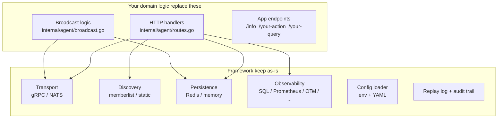
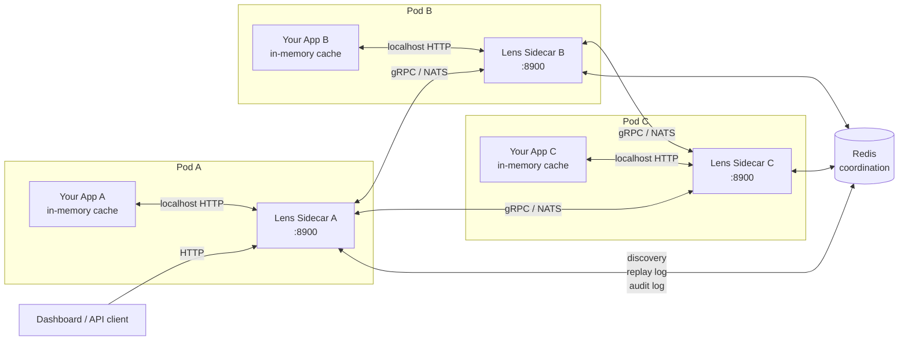
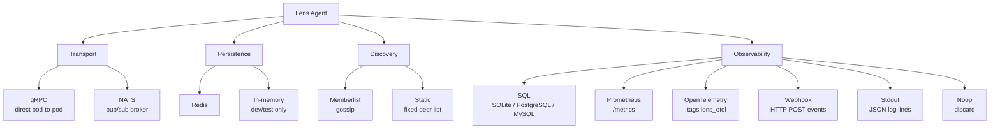
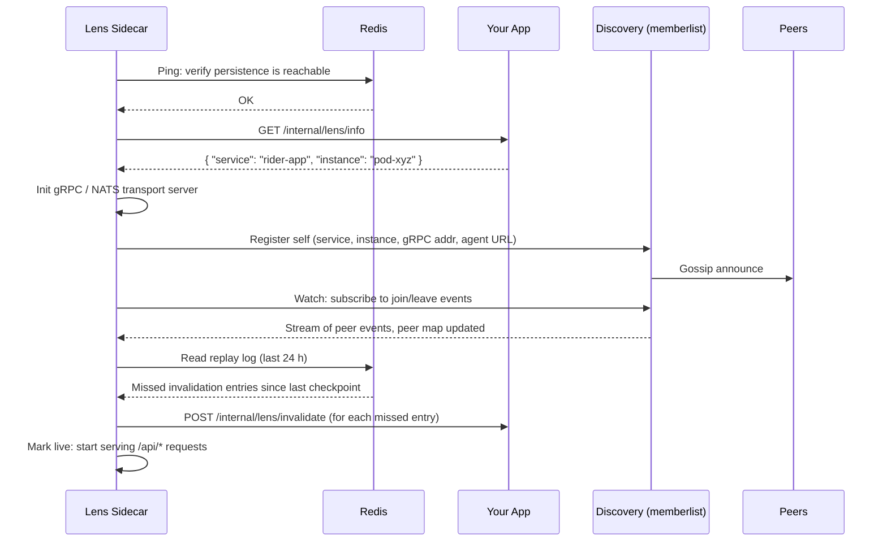
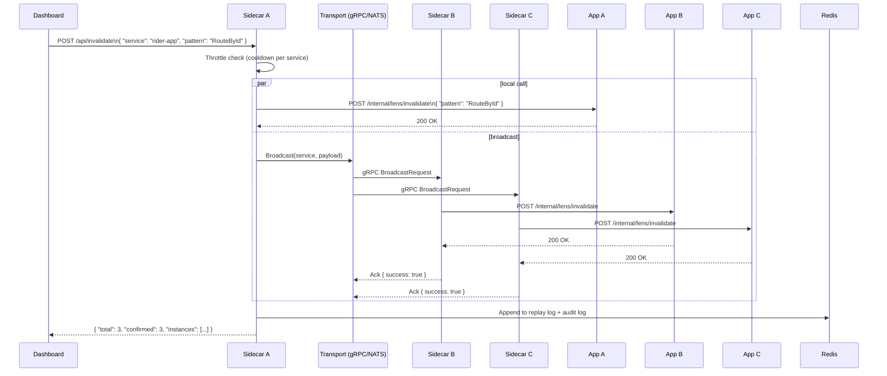
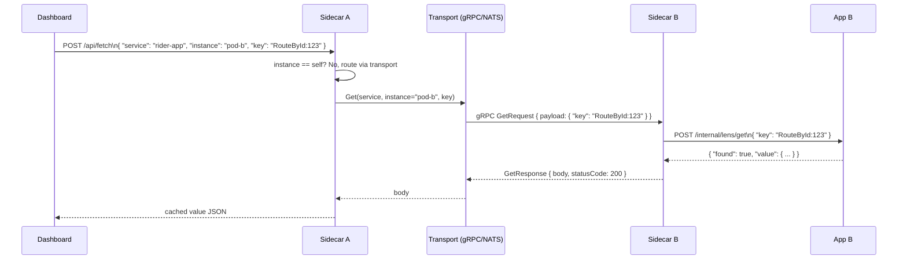

# Lens

A reusable Go sidecar framework with pluggable transport, discovery, persistence, and observability. Fork it, replace the domain logic, and ship.

Building a sidecar means solving the same four infrastructure problems every time: how do pods find each other, how do they communicate, where does shared state live, and how do you observe what is happening across the fleet. Most teams solve these ad-hoc and repeat the work for every new sidecar they build.

Lens solves them once as a single, well-tested codebase. Every layer is a named provider behind a clean interface. You fork the repo, replace the HTTP handlers and broadcast logic with your own domain behaviour, and the entire infrastructure stack comes with it. The included cache-visibility implementation demonstrates all four layers working together end to end, but that is the reference, not the limit.

---

## What is already solved

**Peer communication.** How pods find and talk to each other without a service mesh. Providers: gRPC (direct, zero broker), NATS (broker fan-out), Kafka (high-throughput), Redis Streams (reuse existing Redis). All implement the same `Transport` interface so nothing else changes when you swap.

**Peer discovery.** How the live pod list stays current. Providers: memberlist (gossip, zero infra), static (fixed seed list), Consul (service catalog), Kubernetes (watches EndpointSlices natively). All emit the same join/leave event stream.

**Shared state.** Replay logs, audit trails, and cross-pod metadata. Providers: Redis, Valkey (Redis-compatible, higher throughput), or in-memory for local dev. All implement the same `Backend` interface.

**Observability.** Structured events at every meaningful moment (invalidations, fetches, peer joins, dead pods). Six providers available, and multiple can run simultaneously.

---

## Providers per layer

### Transport

| Provider | `LENS_TRANSPORT` | When to use |
|---|---|---|
| gRPC | `grpc` | Default. Direct pod-to-pod, lowest latency, no broker required. |
| NATS | `nats` | Pods behind NAT or in separate subnets, or a broker is already in place. |
| Kafka | `kafka` | High-throughput fan-out, Kafka already in your stack. Build tag: `lens_kafka`. |
| Redis Streams | `redis-streams` | Reuses your existing Redis instance, zero extra infrastructure. |

### Discovery

| Provider | `LENS_DISCOVERY` | When to use |
|---|---|---|
| Memberlist | `memberlist` | Default. Gossip-based, works on any network that allows UDP between pods. |
| Static | `static` | Fixed deployments where the pod list is known and gossip is not available. |
| Consul | `consul` | Consul service catalog already in use for service registration. Build tag: `lens_consul`. |
| Kubernetes | `kubernetes` | Native K8s deployments. Watches EndpointSlices directly. Build tag: `lens_k8s`. |

### Persistence

| Provider | `LENS_PERSISTENCE` | When to use |
|---|---|---|
| Redis | `redis` | Default. Production: durable replay log, audit trail, shared metadata. |
| Valkey | `valkey` | Redis-compatible, higher throughput. Drop-in replacement. Build tag: `lens_valkey`. |
| In-memory | `memory` | Local dev and tests. Zero infrastructure. State is lost on restart. |

### Observability

Multiple providers can be active at the same time.

| Provider | Config name | What it does |
|---|---|---|
| SQL | `sql` | Powers the built-in Lens dashboard. You provide a SQLite, PostgreSQL, or MySQL instance. Lens writes structured events to it and the dashboard UI queries it via `/api/obs/*`. |
| Prometheus | `prometheus` | Exposes a `/metrics` endpoint for Prometheus scraping. |
| OpenTelemetry | `otel` | Emits traces and metrics via OTLP. Compile with `-tags lens_otel`. |
| Webhook | `webhook` | POSTs a JSON event payload to a configurable URL on every event. |
| Stdout | `stdout` | Writes JSON events to stdout. Feeds into any log aggregation pipeline. |
| Noop | `noop` | Discards all events. Default when no provider is configured. |

---

## Using Lens as your own sidecar

The framework and the domain logic have a clean boundary. The grey boxes below are the infrastructure layer you keep as-is. The white boxes are what you replace with your own behaviour.



**Steps to fork:**

1. Fork the repo on GitHub.
2. Replace the HTTP handlers in `internal/agent/routes.go` with your own endpoints and response shapes.
3. Replace the broadcast logic in `internal/agent/broadcast.go` with your own payload structure and action.
4. Expose three endpoints on your target app: an identity endpoint, an action endpoint (what the sidecar calls on each pod), and optionally a query endpoint (for peer-to-peer fetch).
5. Pick your providers with environment variables. Everything else is wired automatically.

Adding a custom provider for any layer takes three steps:

```go
// Step 1: implement the interface and register in init()
func init() {
    transport.Register("kafka", func(host transport.TransportHost, cfg map[string]any) (transport.Transport, error) {
        return newKafkaTransport(host, cfg)
    })
}
```

```go
// Step 2: blank import in main.go
import _ "github.com/Vedanshu7/lens/internal/transport/kafka"
```

```bash
# Step 3: switch to it with one env var
LENS_TRANSPORT=kafka go run .
```

No changes anywhere else in the codebase.

---

## Swap any layer without changing code

Every layer switches with a single environment variable. The binary does not change.

| Layer | Default | Alternatives | How to switch |
|---|---|---|---|
| Transport | `grpc` | `nats`, `kafka`, `redis-streams` | `LENS_TRANSPORT=nats` |
| Persistence | `redis` | `valkey`, `memory` | `LENS_PERSISTENCE=memory` |
| Discovery | `memberlist` | `static`, `consul`, `kubernetes` | `LENS_DISCOVERY=static` |
| Observability | `noop` | `sql`, `prometheus`, `otel`, `webhook`, `stdout` | config file |

**Local dev with zero external dependencies:**

```bash
LENS_TRANSPORT=grpc \
LENS_PERSISTENCE=memory \
LENS_DISCOVERY=static \
go run .
```

**Production with NATS and OpenTelemetry:**

```bash
LENS_TRANSPORT=nats \
LENS_NATS_URL=nats://broker:4222 \
LENS_PERSISTENCE=redis \
LENS_REDIS_ADDR=redis:6379 \
LENS_DISCOVERY=memberlist \
go run .
```

Same binary, same business logic, entirely different infrastructure underneath.

---

## Architecture

How the framework runs in production. Each pod runs a Lens sidecar. Sidecars discover each other via gossip or a static list and coordinate through Redis. Any API client or dashboard talks to one sidecar; that sidecar routes to the rest.



---

## Provider system



---

## Reference implementation: cache visibility

The following describes how Lens uses the framework for its built-in cache-visibility use case. Your implementation follows the same startup, broadcast, and fetch patterns with your own payloads and app endpoints.

### Startup sequence



### Broadcast flow



### Fetch flow



---

## Quick start

The quick start runs the cache-visibility reference implementation. Replace the target app endpoints with your own to adapt it.

**Run from source:**

```bash
LENS_TARGET_URL=http://localhost:8080 \
LENS_REDIS_ADDR=localhost:6379 \
go run github.com/vedanshu/lens
```

**Docker:**

```bash
docker run --rm \
  -e LENS_TARGET_URL=http://your-app:8080 \
  -e LENS_REDIS_ADDR=redis:6379 \
  -p 8900:8900 \
  ghcr.io/Vedanshu7/lens:latest
```

---

## Integrating your app

Your app keeps its in-memory cache exactly as-is. Expose three HTTP endpoints so the sidecar can interact with it.

### 1. Identity endpoint (required)

```
GET /internal/lens/info
-> { "service": "rider-app", "instance": "rider-app-pod-xyz" }
```

Called once at startup. `service` is the logical service name shared by all pods. `instance` is unique per pod (use the pod name or hostname).

### 2. Fetch endpoint (required)

```
POST /internal/lens/get
<- { "key": "RouteById:config-id:route-123" }
-> { "found": true, "value": { "vehicleType": "SUV" } }
```

Look up the key in your in-memory cache and return its current value. Return `"found": false` when the key is not present.

### 3. Invalidate endpoint (required)

```
POST /internal/lens/invalidate
<- { "pattern": "RouteById" }
-> 200 OK
```

Remove any cached entries whose key contains `pattern`. Pass `null` to clear the entire cache.

### 4. Declare endpoint (optional, enables dashboard visibility)

```
POST http://localhost:8900/api/declare
<- { "keyName": "RouteById:config-id:route-123", "keySchema": null, "ttlInSeconds": 3600 }
-> 200 OK
```

Call this whenever your app writes to its cache. The sidecar stores the key metadata so the dashboard can list and browse keys. Without this, get and invalidate still work but keys will not appear in the dashboard.

---

## Sidecar API

All endpoints work from any sidecar. The dashboard only needs to reach one.

| Method | Endpoint | Description |
|---|---|---|
| `GET` | `/api/health` | Connectivity check (Redis, target, observability). |
| `GET` | `/api/services` | List all services with live sidecars. |
| `GET` | `/api/nodes?service=X` | List live pods for a service. |
| `GET` | `/api/keys?service=X` | List declared cache keys for a service. |
| `GET` | `/api/keys?service=X&instance=Y` | List keys declared by a specific pod. |
| `POST` | `/api/fetch` | Read a cached value from a specific pod's memory. |
| `POST` | `/api/invalidate` | Clear cache entries across all pods of a service. |
| `POST` | `/api/declare` | Register a cache key (called by your app). |
| `GET` | `/api/audit` | Recent invalidation audit log (last 500 entries). |
| `GET` | `/metrics` | Prometheus metrics (when prometheus provider is active). |
| `GET` | `/api/obs/latency` | Per-service latency histogram (SQL observer required). |
| `GET` | `/api/obs/flow` | Invalidation/fetch throughput (SQL observer required). |
| `GET` | `/api/obs/deadpods` | Pods that timed out during invalidation. |
| `GET` | `/api/obs/discovery` | Peer join/leave events. |
| `GET` | `/api/obs/summary` | Aggregate summary for a service. |

---

## Configuration

All configuration is via `LENS_*` environment variables or a `lens.yaml` file.

| Variable | Default | Description |
|---|---|---|
| `LENS_TARGET_URL` | `http://localhost:8080` | Base URL of the service this sidecar is attached to. |
| `LENS_PORT` | `8900` | HTTP port the sidecar listens on. |
| `LENS_BIND_ADDR` | `127.0.0.1` | Local address the HTTP server binds to. |
| `LENS_TOKEN` | _(empty)_ | Shared secret sent as `x-lens-token`. Empty disables auth. |
| `LENS_LOG_LEVEL` | `info` | Minimum log level: `debug`, `info`, `warn`, `error`. |
| `LENS_TRANSPORT` | `grpc` | Transport provider: `grpc` or `nats`. |
| `LENS_PERSISTENCE` | `redis` | Persistence provider: `redis` or `memory`. |
| `LENS_DISCOVERY` | `memberlist` | Discovery provider: `memberlist` or `static`. |
| `LENS_REDIS_ADDR` | `localhost:6379` | Redis server address (`host:port`). |
| `LENS_REDIS_DB` | `0` | Redis database index. |
| `LENS_GRPC_PORT` | `8901` | Port the gRPC server listens on. |
| `LENS_NATS_URL` | `nats://localhost:4222` | NATS server URL. |
| `LENS_GOSSIP_PORT` | `7946` | UDP port for the memberlist gossip protocol. |
| `LENS_ADVERTISE_ADDR` | _(auto-detected)_ | IP peers use to reach this pod. Override when behind NAT. |
| `LENS_COOLDOWN_MS` | `1000` | Minimum ms between invalidations for the same service. |
| `LENS_REPLAY_ENABLED` | `true` | Replay missed invalidations on startup. |
| `LENS_REPLAY_WINDOW_HOURS` | `24` | How far back the replay log is scanned on startup. |

---

## Dashboard

The React dashboard is served at `/` when `dashboard/dist` is present next to the binary.

```bash
cd dashboard
npm install
npm run build
```

Start the sidecar and open `http://localhost:8900`.

---

## Building from source

```bash
git clone https://github.com/Vedanshu7/lens.git
cd lens
go build ./...
```

Enable the OpenTelemetry provider (adds the `go.opentelemetry.io/otel` dependency):

```bash
go build -tags lens_otel ./...
```

Minimum Go version: **1.24**.

---

## License

MIT. See [LICENSE](LICENSE).
