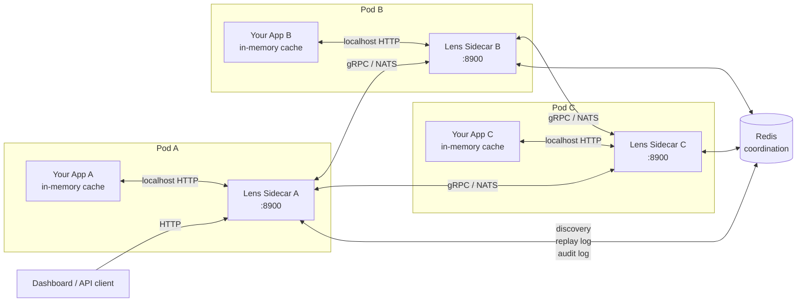
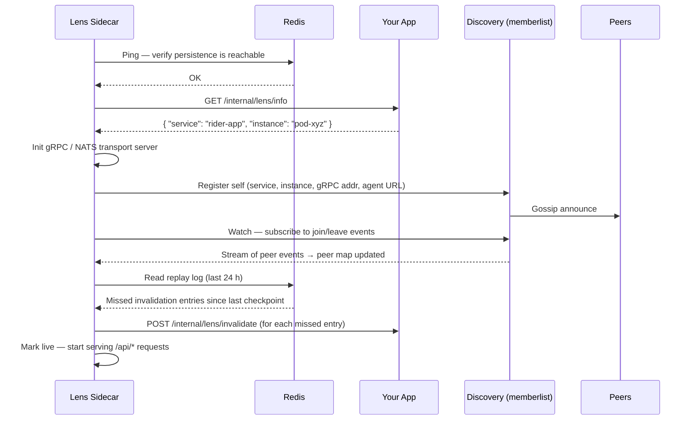
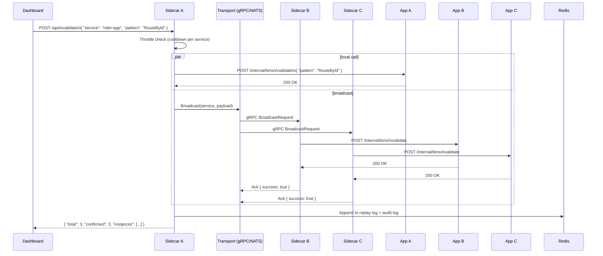

# Lens

Observe, inspect, and invalidate in-memory caches across your entire fleet — without touching a single pod.

Your services cache aggressively and for good reason. But in-memory state is opaque. A stale entry in production means a pod restart, a blind `kubectl exec`, or a guess. Scale that to dozens of services and hundreds of pods and debugging becomes archaeology.

Lens is a lightweight sidecar that sits next to each pod and speaks a common protocol. Add three endpoints to your app, drop Lens alongside it, and you get a live view of every cached key on every pod — with the ability to inspect any value or clear any key across an entire service in a single API call.

---

## Architecture

Each pod runs Lens as a sidecar process. Sidecars discover each other via gossip (memberlist) or a static list and coordinate through Redis. The dashboard talks to any single sidecar — that sidecar routes to the rest.



---

## Provider system

Lens is built around four pluggable subsystems. Each provider registers itself via `init()` — adding a new one is a blank import in `main.go`.


---

## Startup sequence

When the sidecar starts it verifies connectivity, fetches its identity from the target app, initialises transport and discovery, then replays any invalidations it missed while it was offline.



---

## Invalidation flow

When you clear a cache key, the receiving sidecar applies it locally and broadcasts to every peer of that service simultaneously. Each peer forwards the call to its own app.



---

## Fetch flow

Fetching a value from a specific pod is routed through the transport layer to the correct sidecar, which reads directly from its app's in-memory cache.


---

## Quick start

**Run from source:**

```bash
LENS_TARGET_URL=http://localhost:8080 \
LENS_REDIS_ADDR=localhost:6379 \
go run github.com/vedanshu/lens
```

**Docker:**

```bash
docker run --rm \
  -e LENS_TARGET_URL=http://your-app:8080 \
  -e LENS_REDIS_ADDR=redis:6379 \
  -p 8900:8900 \
  ghcr.io/vedanshu/lens:latest
```

---

## Integrating your app

Your app keeps its in-memory cache exactly as-is. Expose three HTTP endpoints so the sidecar can interact with it.

### 1. Identity endpoint (required)

```
GET /internal/lens/info
→ { "service": "rider-app", "instance": "rider-app-pod-xyz" }
```

Called once at startup. `service` is the logical service name shared by all pods. `instance` is unique per pod (use the pod name or hostname).

### 2. Fetch endpoint (required)

```
POST /internal/lens/get
← { "key": "RouteById:config-id:route-123" }
→ { "found": true, "value": { "vehicleType": "SUV" } }
```

Look up the key in your in-memory cache and return its current value. Return `"found": false` when the key is not present.

### 3. Invalidate endpoint (required)

```
POST /internal/lens/invalidate
← { "pattern": "RouteById" }
→ 200 OK
```

Remove any cached entries whose key contains `pattern`. Pass `null` to clear the entire cache.

### 4. Declare endpoint (optional — enables dashboard visibility)

```
POST http://localhost:8900/api/declare
← { "keyName": "RouteById:config-id:route-123", "keySchema": null, "ttlInSeconds": 3600 }
→ 200 OK
```

Call this whenever your app writes to its cache. The sidecar stores the key metadata so the dashboard can list and browse keys. Without this, get and invalidate still work — you just won't see keys listed.

---

## Sidecar API

All endpoints work from any sidecar. The dashboard only needs to reach one.

| Method | Endpoint | Description |
|---|---|---|
| `GET` | `/api/health` | Connectivity check (Redis, target, observability). |
| `GET` | `/api/services` | List all services with live sidecars. |
| `GET` | `/api/nodes?service=X` | List live pods for a service. |
| `GET` | `/api/keys?service=X` | List declared cache keys for a service. |
| `GET` | `/api/keys?service=X&instance=Y` | List keys declared by a specific pod. |
| `POST` | `/api/fetch` | Read a cached value from a specific pod's memory. |
| `POST` | `/api/invalidate` | Clear cache entries across all pods of a service. |
| `POST` | `/api/declare` | Register a cache key (called by your app). |
| `GET` | `/api/audit` | Recent invalidation audit log (last 500 entries). |
| `GET` | `/metrics` | Prometheus metrics (when prometheus provider is active). |
| `GET` | `/api/obs/latency` | Per-service latency histogram (SQL observer required). |
| `GET` | `/api/obs/flow` | Invalidation/fetch throughput (SQL observer required). |
| `GET` | `/api/obs/deadpods` | Pods that timed out during invalidation. |
| `GET` | `/api/obs/discovery` | Peer join/leave events. |
| `GET` | `/api/obs/summary` | Aggregate summary for a service. |

---

## Configuration

All configuration is via `LENS_*` environment variables or a `lens.yaml` file.

| Variable | Default | Description |
|---|---|---|
| `LENS_TARGET_URL` | `http://localhost:8080` | Base URL of the service this sidecar is attached to. |
| `LENS_PORT` | `8900` | HTTP port the sidecar listens on. |
| `LENS_BIND_ADDR` | `127.0.0.1` | Local address the HTTP server binds to. |
| `LENS_TOKEN` | _(empty)_ | Shared secret sent as `x-lens-token`. Empty disables auth. |
| `LENS_LOG_LEVEL` | `info` | Minimum log level: `debug`, `info`, `warn`, `error`. |
| `LENS_TRANSPORT` | `grpc` | Transport provider: `grpc` or `nats`. |
| `LENS_PERSISTENCE` | `redis` | Persistence provider: `redis` or `memory`. |
| `LENS_DISCOVERY` | `memberlist` | Discovery provider: `memberlist` or `static`. |
| `LENS_REDIS_ADDR` | `localhost:6379` | Redis server address (`host:port`). |
| `LENS_REDIS_DB` | `0` | Redis database index. |
| `LENS_GRPC_PORT` | `8901` | Port the gRPC server listens on. |
| `LENS_NATS_URL` | `nats://localhost:4222` | NATS server URL. |
| `LENS_GOSSIP_PORT` | `7946` | UDP port for the memberlist gossip protocol. |
| `LENS_ADVERTISE_ADDR` | _(auto-detected)_ | IP peers use to reach this pod. Override when behind NAT. |
| `LENS_COOLDOWN_MS` | `1000` | Minimum ms between invalidations for the same service. |
| `LENS_REPLAY_ENABLED` | `true` | Replay missed invalidations on startup. |
| `LENS_REPLAY_WINDOW_HOURS` | `24` | How far back the replay log is scanned on startup. |

---

## Dashboard

The React dashboard is served at `/` when `dashboard/dist` is present next to the binary.

```bash
cd dashboard
npm install
npm run build
```

Start the sidecar and open `http://localhost:8900`.

---

## Building from source

```bash
git clone https://github.com/vedanshu/lens.git
cd lens
go build ./...
```

Enable the OpenTelemetry provider (adds the `go.opentelemetry.io/otel` dependency):

```bash
go build -tags lens_otel ./...
```

Minimum Go version: **1.24**.

---

## License

MIT.
