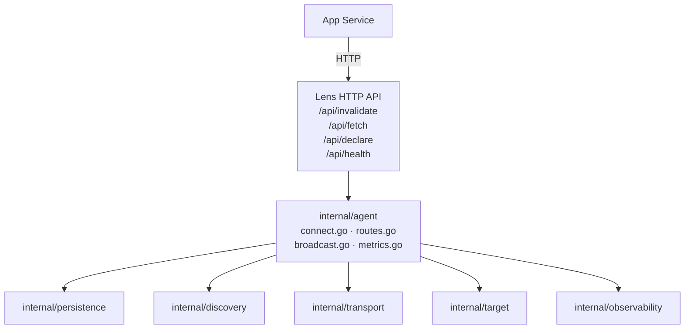
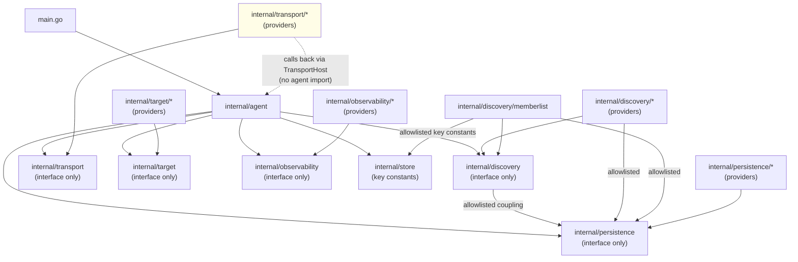
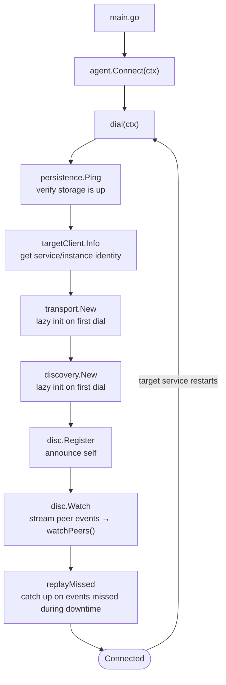

# Lens Architecture Reference

This document describes the internal structure of the Lens sidecar, the design decisions behind each layer boundary, and the rules that must hold for the system to stay extensible.

---

## Overview

Lens is a sidecar process. One instance runs alongside each replica of a service. Sidecars discover each other, broadcast cache invalidation events over a pluggable transport, log events for replay, and expose an HTTP API and dashboard.



The five swappable layers are independently compilable. `internal/agent` is the only package that imports them all.

---

## The five layers

### `internal/persistence` — key-value storage

**Interface:** `persistence.Backend`

Provides key-value, list, hash, and set operations. Used for:
- Replay log (`lens:log:<svc>`) — invalidation events buffered for catch-up on restart
- Audit log (`lens:audit`) — last 500 invalidation records
- Cache key registry (`lens:cache:<svc>:<instance>`) — declared keys per instance
- Service set (`lens:services`) — all known service names
- Provider stack (`lens:providers:<svc>`) — JSON stack snapshot per service
- Checkpoint (`lens:checkpoint:<svc>:<instance>`) — last-seen timestamp for replay

**Providers:** `redis` (default), `memory` (test/dev), `natskv`

**Design note:** All key naming lives in `internal/store/keys.go`. Do not hardcode key strings in provider or agent code.

---

### `internal/discovery` — peer discovery

**Interface:** `discovery.Resolver`

Discovers live peers of a named service and streams lifecycle events via `Watch`. The agent uses the peer list to know which instances to broadcast to and which `AgentURL` to proxy requests through.

**Providers:** `memberlist` (gossip UDP), `nats`, `dnssrv` (Kubernetes headless service), `static`

**Design note — the persistence coupling:**

`discovery.Factory` is defined as:

```go
type Factory func(backend persistence.Backend, cfg map[string]any) (Resolver, error)
```

The `backend` parameter is supplied so discovery providers that need to bootstrap from shared storage (e.g., memberlist reads seed IPs from Redis on startup) can do so without their own persistence connection. Providers that don't need it accept and discard it (`_ persistence.Backend`).

This is the only cross-interface import in the codebase. It is allowlisted in `test/unit/imports/layer_isolation_test.go`. Do not add more cross-interface imports without updating that file and documenting the reason here.

If you are building a discovery provider that has no use for persistence (e.g., mDNS), accept the parameter but ignore it. Do not make persistence optional at the factory level — it would require a new overloaded registry entry and complicates the dispatch logic.

---

### `internal/transport` — sidecar-to-sidecar messaging

**Interface:** `transport.Transport`

Delivers invalidation payloads to all live peers of a service (`Broadcast`) and fetches a specific cache key from a specific peer (`Get`).

**Providers:** `grpc` (default), `nats`, `kafka`, `zeromq`, `redisstreams`

**Design note — the TransportHost callback pattern:**

Transport providers need to call back into the agent when they receive an incoming message from a peer. Importing `internal/agent` would create an import cycle. Instead, `internal/transport/transport.go` defines the `TransportHost` interface:

```go
type TransportHost interface {
    PeersForService(svc string) []PeerAddr
    ApplyInvalidation(ctx context.Context, payload []byte, origin string)
    WriteInvalidationLog(ctx context.Context, svc string, payload []byte)
    GetFromTarget(ctx context.Context, payload []byte) ([]byte, error)
    SelfInstance() string
    SelfService() string
}
```

`*agent.Agent` implements `TransportHost`. When the agent creates a transport provider it passes itself as the host:

```go
t, err := itransport.New(a, a.Config.Transport, a.Config.TransportConfig)
```

When the transport receives a broadcast from a peer, it calls:
1. `host.WriteInvalidationLog(ctx, svc, payload)` — logs the event for replay
2. `host.ApplyInvalidation(ctx, payload, origin)` — delivers to the local target

This pattern lets the transport layer depend on the agent's behaviour without importing the agent package.

---

### `internal/target` — sidecar-to-app communication

**Interface:** `target.TargetClient`

The target is the co-located application service. The client calls its three required endpoints:
- `GET /internal/lens/info` — returns service and instance identity
- `POST /internal/lens/invalidate` — delivers an invalidation payload
- `POST /internal/lens/get` — fetches a cache key's current value
- `GET /internal/lens/keys` — lists declared cache keys (optional)

**Providers:** `http` (default), `unix` (Unix domain socket), `grpc`

---

### `internal/observability` — telemetry

**Interface:** `observability.Observer`

Records structured `Event` values at key moments (invalidate, fetch, peer join/leave, replay, dead pod detection). The `MultiObserver` fans out to all configured providers via a bounded 512-event channel — events are dropped when the channel is full so the hot path is never blocked.

The `SQLQuerier` extension of `Observer` exposes dashboard query methods. Only the `sql` provider implements it.

**Providers:** `sql` (SQLite/Postgres/MySQL), `prometheus`, `otel`, `webhook`, `stdout`, `noop` (default)

---

## Provider registration

Providers self-register via `init()` using blank imports:

```go
// In main.go or cmd/lens-build/main.go:
import _ "github.com/Vedanshu7/lens/internal/persistence/redis"

// In internal/persistence/redis/redis.go:
func init() {
    persistence.Register("redis", func(cfg map[string]any) (persistence.Backend, error) {
        return newRedisBackend(cfg)
    })
}
```

At startup, `agent.New(cfg)` calls `persistence.New(cfg.Persistence, cfg.PersistenceConfig)` which looks up the registered factory by name. `cmd/lens-build` generates the provider imports from `lens.yaml`.

---

## Import graph (condensed)



**Enforced by:** `go test ./test/unit/imports/` — fails CI on any new violation.

---

## Agent connection lifecycle



On reconnect (target service restarts), `Connect` loops and re-runs `dial`. Transport and discovery providers are reused across reconnects because they are independent of the target HTTP connection.

---

## Layer independence verification

The `test/unit/matrix/` package exercises every available in-process provider combination end-to-end, verifying that swapping any layer does not change the observable behavior:

```bash
go test ./test/unit/matrix/
```

Current matrix (providers that require no external services):

| Transport | Discovery | Persistence |
|-----------|-----------|-------------|
| stub      | stub      | memory      |
| stub      | static    | memory      |

Add new rows as more in-process providers become available.
